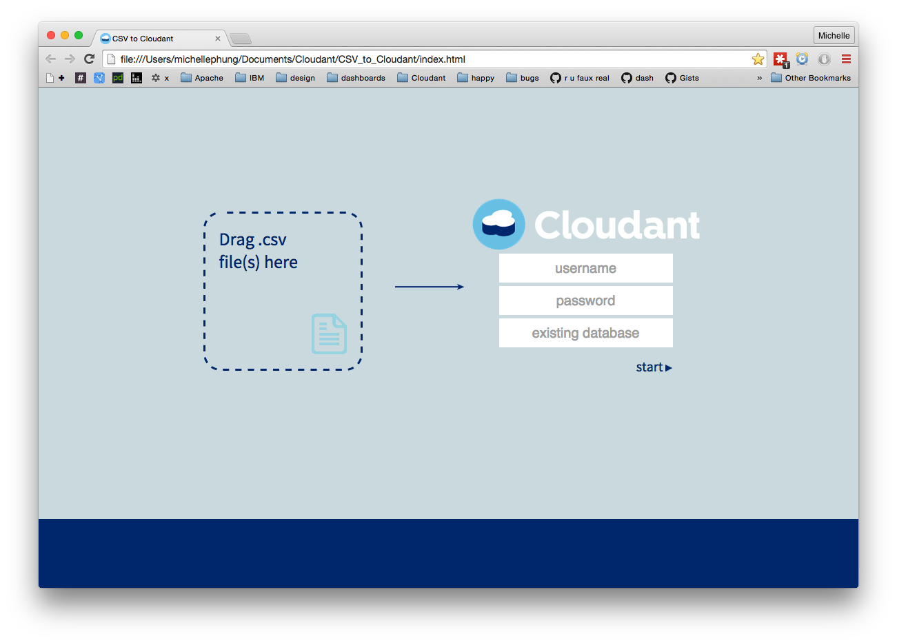
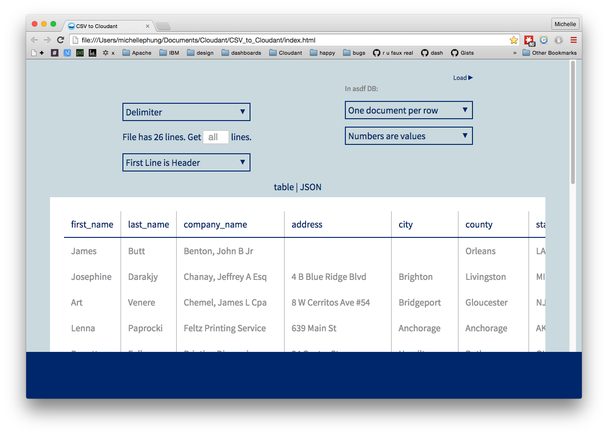
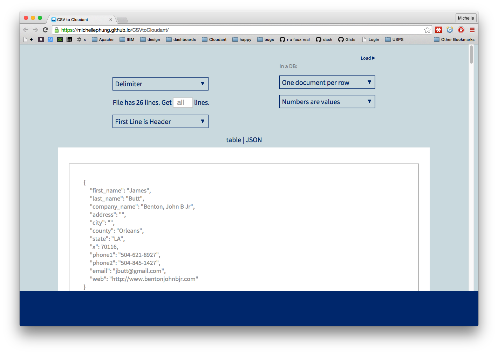

#READ ME

[Working UI](https://michellephung.github.io/CSVtoCloudant/)  

This is a webpage which lets you drag and drop a .csv file and then edit how it will be loaded into a Cloudant Database

[Website](https://michellephung.github.io/CSVtoCloudant/)

[Download locally](https://github.com/michellephung/CSVtoCloudant) website to view source code

[Fork](https://github.com/michellephung/CSVtoCloudant) (here)

==========

# Files To Use the UI on the web:

- Database must already exist on Cloudant
1. Drop in a CSV file from you computer
2. Enter your username, password, and the database name
3. 'Start'
4. 'Load'  

# To Use the UI locally:  
1. Download a zip of the source code, or fork it!
1. Unzip the file and click on the folder inside
1. Click on index.html file to view the page
2. Your browser should open to the UI
3. If it doesn't, drag the file into your browser
4. Use as you would the data importer on the Web

File Will Fail to Load if:    
- Incorrect Name or Password or Database  
- CORS is not enabled user's account

Please Note:

1. Currently, loading feedback (green text) will change to 'Success', after the first successful document is loaded into Cloudant. 

2. Document id's will be UUID.

To Do:   

1. Remove 'database' field from page 1, then on page 2, add dropdown for which database you want to load docs into  

4. Add a progress bar to first/second page when parsing large files. [Currently page is unresponsive while parsing large files-- very noticable lag on csv file with 300+ rows]  

5. Get dropdown menus to work in Firefox

